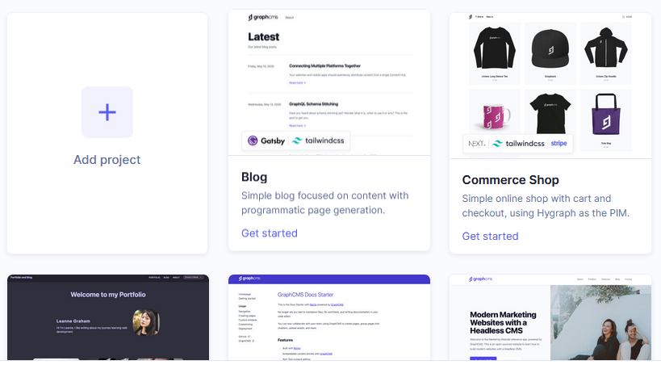
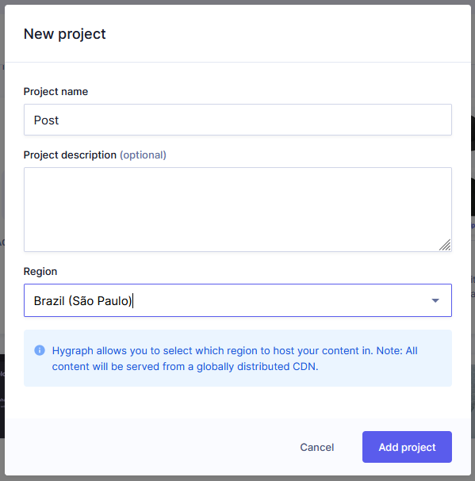
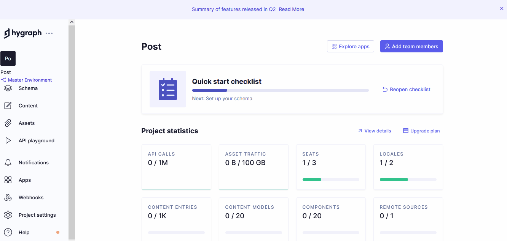
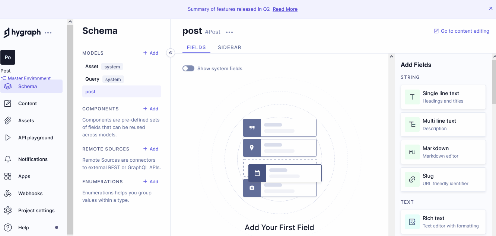
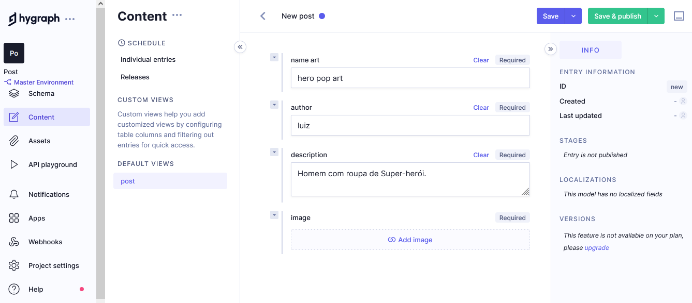
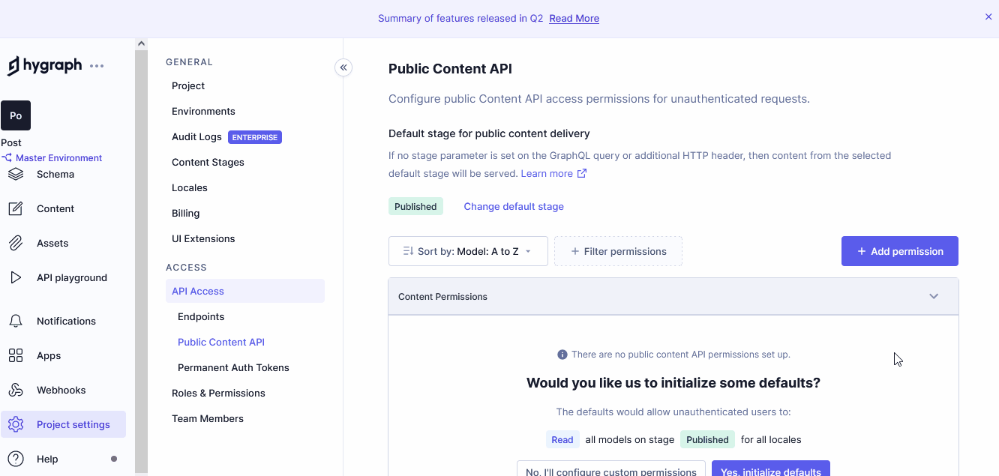
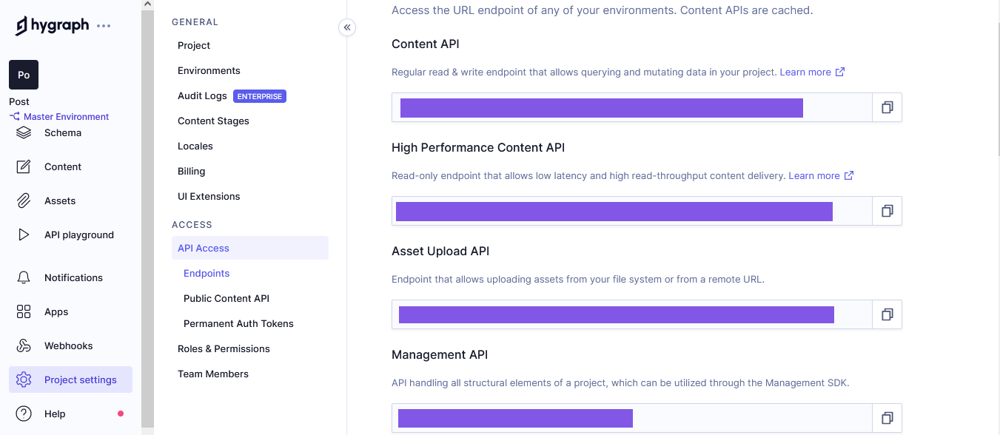

# POP ART


O Pop Art é o site de uma galeria de arte que tem como principal funcionalidade divulgar a exposição de trabalhos de vários artistas.
Esse site é desenvolvido com o framework nextjs e integrado a um CMS(hygraph) cuja responsabilidade é fazer o gerenciamento das informações contidas na página "galeria".

Passo a passo da integração.

1. As informações são arquivadas no hygraph(CMS).
2. O hygraph(CMS) disponiliza essa informações através de uma api GraphQL.
3. O Nextjs consome as informações da api GraphQL e disponiliza na pagina "galeria".


## 👨‍🏫 Demostração do sistema.


- [x] Full Responsive.
- [x] Mobile First.

## 🔨 Tecnologias Utilizadas.
 
 1. [Nextjs](https://nextjs.org/)
 2. [Apollo GraphQL](https://www.apollographql.com/)
 3. [Hygraph(CMS)](https://hygraph.com/)
 4. [Api GraphQL](https://graphql.org/)

## 🌐 Acessar o projeto.

### [POP ART](https://felipedev-popart.vercel.app/)

## 👨‍💻  Como Executar o Projeto no seu Computador.

### Passo a passo

1.0 Clone o Repositório.
```sh
git clone git@github.com:FelipeDevFull/popart.git
```
1.1 Acesse o repositório do projeto.
```sh
cd popart
```
1.2 Crie o Arquivo ".env.local"
```sh
cp .env.example .env.local
```
1.3 Adicione a variável de ambiente abaixo ao arquivo ".env.local"
```sh
 NEXT_PUBLIC_API_URL = 
```
1.4 Instale as Dependências no projeto.
```sh
npm install package.json
```


#### 2.0 Faça um cadastro no hygraph(cms).


#### 2.1 Crie um projeto com o nome de "post"



#### 2.2 Crie um "model" com o nome "post"


#### 2.3 Crie um formulário.


#### 2.4 Cadastre as informações.


#### 2.5 Adicione permissões a api.


#### 2.6 Capture o link do "Content API" e insira no arquivo ".env.local" do projeto.


#### 2.7 .env.local.
```sh
 NEXT_PUBLIC_API_URL = xxxxxxxxxxxxxxxxxxxxxx
```

#### 2.8 Execute o camando abaixo.
```sh
 npm rum dev
```

ACESSE O PROJETO: 
[http://localhost:3000](http://localhost:3000)